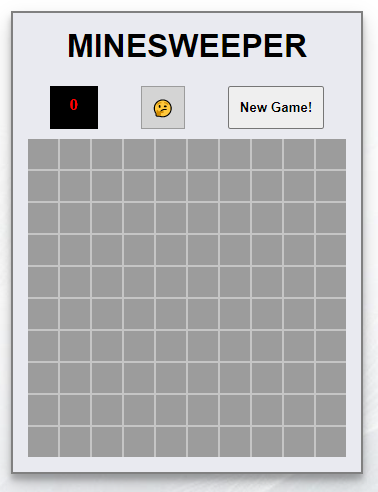

# MinesWeeper challengue 💥

Made this with _React JS_.

## Deploy: https://cufavarela.github.io/MInesWeeper/

## Rules

Minesweeper rules are very simple. The board is divided into cells, with mines randomly distributed. To win, you need to open all the cells. The number on a cell shows the number of mines adjacent to it. Using this information, you can determine cells that are safe, and cells that contain mines. Cells suspected of being mines can be marked with a flag using the right mouse button. 🎮

## Little Help

The **black** display in the top-left side of the game, shows you how many mines you have successfully found! 😁
